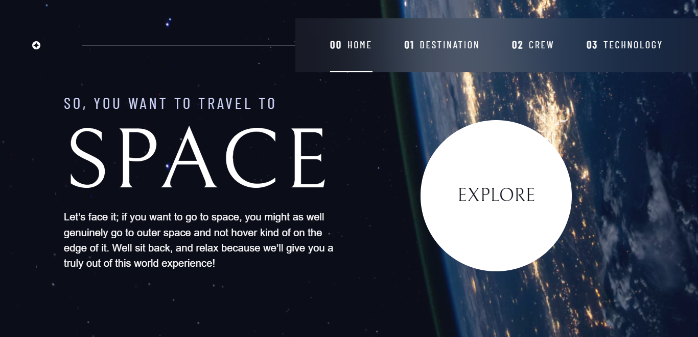
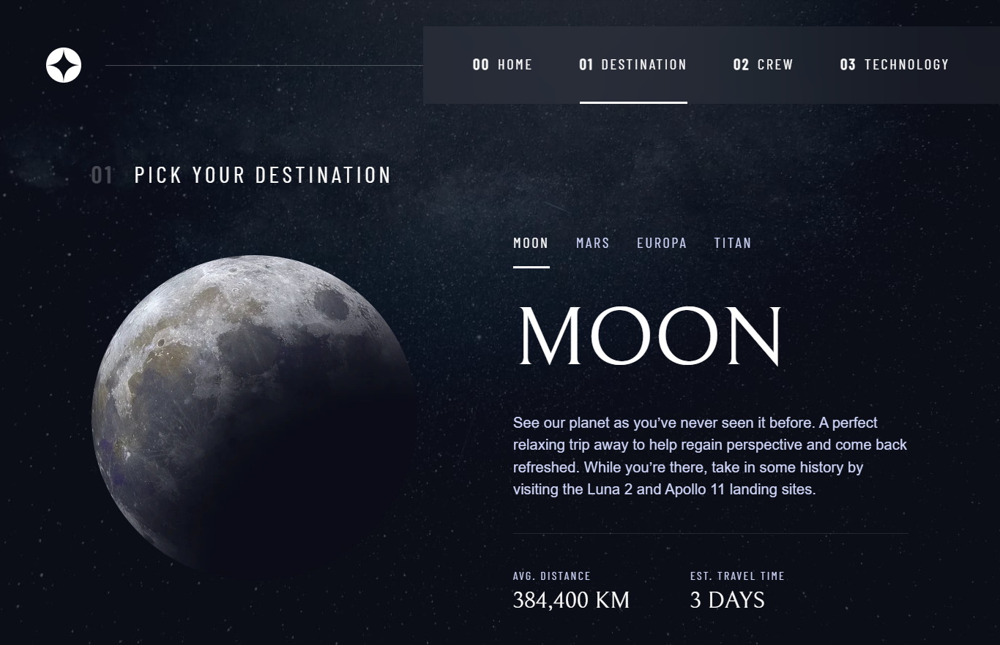

# Frontend Mentor - Space tourism website solution

This is a solution to the [Space tourism website challenge on Frontend Mentor](https://www.frontendmentor.io/challenges/space-tourism-multipage-website-gRWj1URZ3). Frontend Mentor challenges help you improve your coding skills by building realistic projects. 

## Table of contents

- [Overview](#overview)
  - [The challenge](#the-challenge)
  - [Screenshot](#screenshot)
  - [Links](#links)
- [My process](#my-process)
  - [Built with](#built-with)
  - [What I learned](#what-i-learned)
  - [Continued development](#continued-development)
- [Author](#author)

**Note: Delete this note and update the table of contents based on what sections you keep.**

## Overview

### The challenge

Users should be able to:

- View the optimal layout for each of the website's pages depending on their device's screen size
- See hover states for all interactive elements on the page
- View each page and be able to toggle between the tabs to see new information

### Screenshot





### Links

- Solution URL: (https://www.frontendmentor.io/solutions/responsive-multipage-website-using-css-grid-6jFa7rPQ49)
- Live Site URL: (https://tiasha26.github.io/Space-Tourism-multi-page-Website/index.html)

## My process

### Built with

- Semantic HTML5 markup
- CSS custom properties
- Flexbox
- CSS Grid
- Javascript
- Mobile-first workflow


### What I learned

I have learnt alot more on CSS and Javascript. I had some challenges however i overcame it by doing some research and learning from my mistakes.


```html
<h1>Some HTML code I'm proud of</h1>
```
```css
.explore {
  font-size: 2rem;
  position: relative;
  z-index: 1;
  display: inline-grid;
  place-items: center;
  background: rgb(var(--clr-white));
  border-radius: 50%;
  padding: 2em;
  aspect-ratio: auto 1 / 1;
  text-decoration: none;
}

.explore::after {
  content: "";
  position: absolute;
  z-index: -1;
  background: rgb(var(--clr-white) /.1);
  width: 100%;
  height: 100%;
  border-radius: 50%;
  opacity: 0;
  transition: opacity 500ms linear, transform 500ms ease-in-out;
}

.explore:hover::after,
.explore:focus::after {
  opacity: 1;
  transform: scale(1.5);
}
```


### Continued development

I would like to work on my Javascript skills and styling skills.


## Author

- Website - [Tiasha](https://tiasha26.github.io/)
- Frontend Mentor - [@Tiasha26](https://www.frontendmentor.io/profile/Tiasha26)

